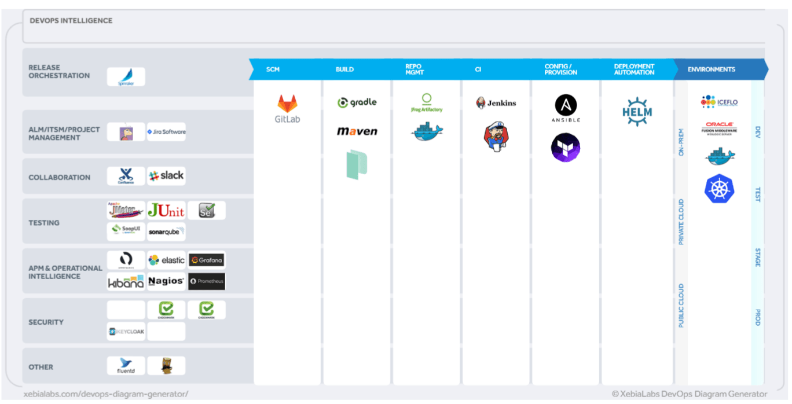

! I work for Oracle and the views expressed in this article are my own.

In this article I intend to elaborate some very practical enterprise problems that arise during their containerization journey from an infrastructure standpoint and also encourage enterprise users to examine On-Premise Kubernetes Managed solutions with a healthy dose of cynicism

## For the Impatient

Please ignore this article if you have a Software Defined Data Center where you have implemented paradigms like

    - Software Defined Infrastructure 
        Storage, Compute, LBs, Routers, Firewall
    - Infrastructure as Code
    - Immutable / Idempotent Configurations
    - Git as the source of truth for everything

Unless you've been living under a rock, you have read/experienced how container technology is re-defining the enterprise IT.

To simplify it

    Docker/LxC/Kata/Rkt        = VMs
    Kuberneres/Mesos           = vSphere/vCenter 

## Summary of points discussed further

* It is simply easier to _run your cloud native workloads on the public cloud_, if you can.
* Managed solutions for Kubernetes on-premises will not necessarily make life easier for you. _They are not magic beans._
* Yes, they make provisioning and some parts of the Ops easier but _is that really the biggest issue_ ?
* Sometimes with these managed solutions _you will need to cut your feet to fit the shoe._
* It does not make sense to _discuss a Kubernetes solution on-premises in isolation_. Software defined infrastructure is key to your success. 
* Keep an eye out for the _licensing metrics on a per-pod/per-container based model_ which almost sounds like a penalty for scaling.
* Beware of **_Kitchen sink solutions !!_**

## Read on if your enterprise Data Center/ IT Landscape has one/many the following characteristics.

> The one word that sums up your IT Landscape is  "**Heterogenous**"

##### Data Center/ Networking:

    - Your Data Center has implemented
        DMZ/ Non-DMZ 
        Trusted and Untrusted Zones
        Internet - Intranet  
        UAT/Dev | Prod | DR
    - Core Switches(L3) and Access Switches(L2) tie your data center together 
    - WAF, perimeter firewall, anti DDOS mostly from different vendors
    - a/many dedicated hardware load-balancer(s)/ application delivery controller(s)

##### Infrastructure :

    - You have SAN Switches connecting multiple storage arrays from Hitachi/ Dell-EMC
    - You have ESXi/ AIX / AHV/ KVM/ OVMs/ Hyper-V in your hypervisor landscape
    - You have both Intel and RISC Compute

##### Application/DB Landscape :

    - Your Database workloads are mostly Oracle, MSSQL, DB2, MySQL
    - The majority of your app layer and middleware runs Weblogic, WebSphere, JBOSS, Tomcat. 
    - You only load balance your Web Tier 
    - Web Tier is mostly a reverse proxy

### App / Infra Modernization Journey :

You also have

    - Recently invested in 
        HCI ( Hyper Converged Infrastructure ) 
        PaaS 
        SaaS 
    - Some of your net new workloads are demanding a
        Container Native Storage 
        Cloud native environment within your data center
    - You have started working on pivoting 
        Service Oriented Architecture
        Microservices
        APIs

While you have begun this journey, the following questions still remain

* I see great potential for these systems in UAT/Sandbox but you are not quite sure how they will integrate to your DC infra in production ?
* How can I leverage/re-purpose my On-Prem ( Storage, Networking, Compute) investments for these cloud native architectures
* Not very confident about the robustness in security/isolation primitives for these paradigms

### It is simply easier to run Kubernetes on the Cloud

* Kubernetes on the public cloud is the easiest to implement where the cloud provider's storage, network and compute is tightly integrated with Kubernetes/ Docker constructs.
* Kubernetes Managed Service from the cloud provider is not vendor-lock in
  because Workload portability is as simple as change in a line or two of code in your Kubernetes Manifest File . Eg.

  StorageClass: 'ebs' --> StorageClass: 'oci'
  Allows you to provision Oracle (OCI) Block Storage instead of Elastic Block Storage (AWS)

> If you have cloud-native workloads or plan to containerize your workloads, do yourself a favour, run them on the public cloud

As an enterprise, if you cannot run these workloads on the cloud and you have undertaken a journey to modernize them on-premise read-on

### Myopic Solutions are an issue

What **Enterprise requirements** usually overlooked by the one-solution fits all approach by vendors ?

* Assuming you have
  * Dev | UAT | PROD Environments
  * Web | App Tier
  * And 3 Apps

  I want them to run out of separate Kubernetes Clusters
  * Would I purchase (3x2x3) 12 HCI Boxes with separate licenses for a managed Kubernetes Service and PaaS ?
  * If yes, can I manage them using a single console ?

If I had to bypass creation and management of those many clusters, the solution provided by many managed vendors is to invest in a Data Center Wide SDN Solution.

The notion that you would need to buy expensive HCI and SDN within your data centers to realize the benefits of containers to start with a small subset is the equivalent of needing

> Buying a **hand-grenade** to kill **houseflies**.

### Selective Outrage on Non-Concerns

* **<u>_Provisioning/Orchestration_</u>** isn't the hard part when it comes to building cloud-native architectures on-premises.
* In Enterprises **<u>Co-existence</u>** with containerized monoliths or legacy is a harder and a far more important problem to solve

### Adding Fuel to Fire

* My Web and App Tier will be containerized , but my database isn't ready
* Web and App Tier cannot/should not run in the same cluster
* I want Physical and Logical Isolation between the two
* I want my Web Tier Kubernetes Cluster to work with my F5/ Citrix Hardware load balancers

### Node Ports are convenient, which is a major problem

* Node Ports are a very convenient way to expose the service externally acorss the cluster, where I don't want my service to be tied to an IP.
* I do not want to open a Cluster-wide NodePort (1 Port per VM) to expose an Application Service to another Tier (Eg. Web Tier )
* This problem gets worse as the size of the cluster gets bigger.

The **number of ports you would need to open in your firewall grows multifold** with

* Number of apps per cluster
* Expose more than one service externally per app

### Sweeping Generalizations

> DIY Kubernetes is hard, Managed Kubernetes will fix all my problems - **Wrong Approach !**

* Some managed Kubernetes Solutions will **not** allow you to due to their opinionated nature
  * Choose Container Networking / Storage
  * Load Balancing
  * Leverage existing investments in Compute/Networking/Storage
* While it is true that Software Defined Everything with HCI ( Compute/ Network /Storage /Data-Center ) is great, it really depends on the scale of your on-premise, container-native requirements to be able to quantify value

### How would I build such a stack ?

An example of how I could build a robust cloud-native stack without significant engineering effort using a service provider within your data center

* IAC ( Infrastructure as Code) - **Terraform**
* Configuration Management - **Ansible**
* Re-usable Machine Images/ Build - **Packer**
* Containerization / Orchestration - **Docker-EE + Kubernetes**
* Software Container Native Storage - **Ceph**
* Software Defined Networking with Security primitives - **Calico**
* Software Defined Kubernetes Load Balancer - **MetalLB**
* CI/CD + Release management - **Jenkins-X + Spinnaker**
* Container Runtime - **Docker-EE**
* Image Repository - **Artifactory-EE**
* STAST and DAST - **Checkmarx /AquaSecurity/Keycloak**
* Infra Monitoring, Alerting and Analytics - **Prometheus + Grafana**
* APM - **Your existing APM vendor**

All of these tools are Cloud-Agnostic / Truly re-usable in a multi-cloud, hybrid cloud environment. It is a combination of CNCF, Open-source, Enterprise Editions of upstream open sourced tools.

#### Q1. Will containers work for me  ?

**Yes**, they definitely are and can bring in significant benefits. The benefits snowball exponentially with scale

#### Q2. Will containers work for me in my data center on-premises ?

**Yes**, they will, but there are some hurdles to overcome. <u> Read On </u>

#### Q3. What are my priorities when it comes to on-prem cloud native journey ?

\* In the short term a software service provider/partner with your existing infrastructure and a flexible toolchain engineered to suit your needs will work better than a one-solution fits all approach.

\* In the long term, data center modernization with a robust SDN that supports container primitives and software defined everything is the way forward.