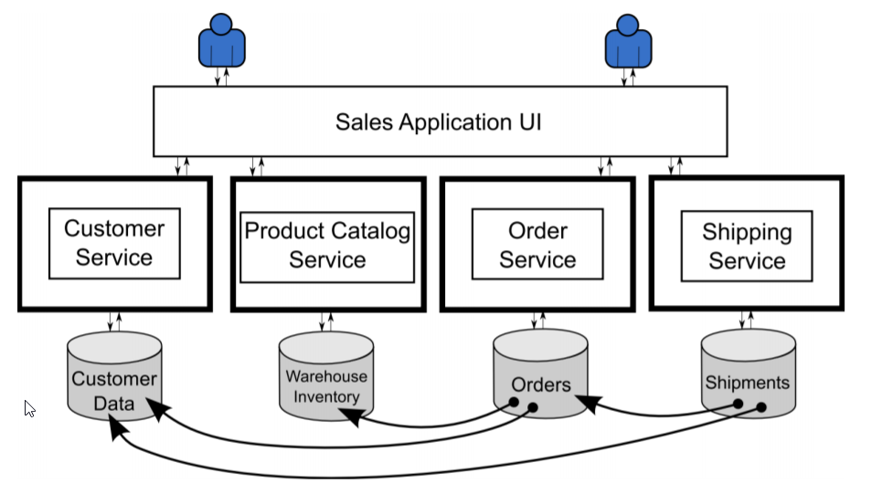

---
categories:
- datastrategy
- enterprise
- microservices
tags:
- sticky
- featured
layout: post
title: Backups from eventually consistent systems could make your business perpetually
  inconsistent
author: vamsi
image: "/assets/images/BackupEventuallyConsistentSystem.png"
color: "#C43A3A"

---
### For the impatient

* Backups are always point in time   And so are restorations. 
* Eventually consistent systems have a time to consistency
* So if there is a system where transactions occur until infinity , time to consistency gets pushed infinitely until the last transaction completed and system eventually reaches consistency.  
* Hence backups from eventually consistent systems are **_permanently inconsistent and obsolete or have risk of data loss_** 
* Co-ordinating Backups from distributed and eventually consistent systems make it even worse
* The worst is when these backups have to be co-ordinated between disparate databases where data is split and stored.

  > Sharing the database between microservices is an anti-pattern

  But the ability to co-ordinate consistent backups between multiple independent databases is life-saving in a microservices architecture.
* Use domain driven design to sensibly isolate and decouple components of business logic that are mutually exclusive
* Loosely coupling/ decomoposing tightly coupled parts of a business transaction for the sake of ease of development will make life harder as issues of establishing transactional boundaries and integrity come into play
* BAC Theorem

  > When one backs up data from multiple disparate databases in a microservices architecture it is impossible to have both consistency and availability
* Even when I do _compromise availability for maintaining consistency_, for eventually consistent systems, it is important to measure _time to consistency_ and understand that I would have to _loose data or make the system unavailable_ for that time.
* Need to understand how checkpoints work in each of these database technologies and work with them and would have to build DIY code to make this happen.
* **Oracle's Multi Tenant Architecture with Container Database design** allows developers to isolate databases and operate pluggable databases as individual databases with independent schemas, tablespaces, users while executing coordinated backups without compromising transactional integrity
* For Linear Horizontal Scalability and fault tolerance with ACID Compliance one may deploy **Oracle Sharding.**

  ### Keep Calm and build enterprise applications
  * Shard databases for a share nothing architecture
  * Run databases as containers with PDBs and CDBs
  * Use a wide variety of ORMs for Oracle
  * [ORDS](https://blogs.oracle.com/oraclemagazine/automatic-rest "ORDS") for REST based async communication with Oracle DB
  * Backup and restore conveniently with [RMAN](https://en.m.wikipedia.org/wiki/RMAN "RMAN")
  * DR with ADG/ODG
  * Realtime CDC with GG
  * Scale Horizontally with Real Application Clusters
  * Scale it insanely with [Exadata](https://www.oracle.com/technetwork/database/exadata/overview/index.html "Exadata")  adata platform 

> If you are from Google, Netflix, Amazon and only want to build a planet scale application that is not a requirement for 99% of the enterprises , please don't read on.

### TL;DR

Designing Microservices the right way can be hard. Defining how one would wish to store and organize data in this decomposed system is the toughest problem to solve.  When the application is broken down into smaller services without mimicking the actual business problem, cracks begin to appear and one ends up doing plumbing with the agile/ devops/ gitops/ noOps or whatever fad methodology it is for the rest of it's life.

> Bad design is everywhere but with microservices you won't even know what hit you

Domain driven design is one of the principles used to define context and boundaries of the application while keeping the overall business transaction in mind.

When this is done right, one can say

> We finally got the Service Oriented Architecture right through microservices.

However this in itself is a topic for a post.

In this post I would like to touch upon the complexities an enterprise would inherit; in a system that is hastily broken up into microservices and use one database per service **_a.k.a polyglot persistence_**

#### What is polyglot persistence

The constant argument that we see from developers as the benefit of this architecture

* The failure of one database does not bring app's availability down.

Some transactions and businesses have the capacity to be modeled this way but some aren't.  For those applications where **_consistency is key_**

> ##### The failure of One database, will push all other databases back in time in order to recover to a consistent state. 

This is a futuristic microservices application that

* is loosely coupled
* each service is written in a language that is most comfortable for the developer
* runs one specialist database per service if it is NodeJs I use Mongo
* one type of database per service
* is event driven
* asynchronous at all levels

In short it is a lazy developer's dream come true and a nightmare for the team that inherits it for operations and maintenance.

Within its own bounded context ( If it exists ) the database may provide provide strong consistency but when you look at it as an overarching system you would see that there are some obvious problems

How would one back this system up that runs multiple databases from multiple vendors and the onus of co-ordination lies with the application tier.

### BAC Theorem

There are two paths that a business can take

* Inconsistent business backups with maximum availability
* Consistent backups but with limited availability

### Inconsistent Business Backups, Maximum Availability

* If the design of the system is such that it is eventually consistent, when I backup I am always at the risk of missing a part of the transaction that is yet to get committed no matter what I do.
* This gets exacerbated when I use multiple databases to split and record  parts of a single business transaction.

> At a given point in time I will always have a backup from at least one of the service that is obsolete

* So when I restore from those backups, I will always restore it to a state that is inconsistent to business.

This is commonplace in a microservices architecture where design is done with failure in mind. If your business is okay with inheriting this system you can get maximum availability with a highly inconsistent business.

Technically we call these

* **Broken Links** :

  Broken links are why we sometimes get an apology email from an e-commerce vendor that they would give us store credits because they went out of stock even after we received an order number and confirmation ( Simplified for understanding )
  1. The order database got updated
  2. The inventory database is just about to get updated
  3. The backup happened before the inventory database got updated
  4. The inventory database gets updated but the backup does not have this information
  5. The system crashed and I restored it
  6. The state of the system is such that the orders database has this information but the inventory database does not.
  7. Another order could get executed against the same item successfully needing a manual reconciliation process or
  8. The application could crash because it does not pass the referential integrity test of the orders database if it is enforced in it.
* **Orphan States :** When the e-commerce vendor sees a discrepancy in the bill against the number of orders that were shipped, he got billed for 6000 additional orders while he only processed 5900 orders that month.
  1. Where the exact opposite of the missing links scenario happens
  2. The orders database gets backed up before it can register

This may be agreeable to some use cases in some businesses, so what if i lost a couple comments and a couple posts in Facebook after recovery ? So what if I did not re-populate video recommendations completely on Netflix after recovery

### Consistent Business Backups, Limited Availability

Assuming that I have figured that I need to write a piece of code/ module that can co-ordinate with all databases, here are a bunch of challenges I would face with doing that

1. To be able to achieve a consistent time-coordinated backup, I should first be able to tell all the services that write/read data from databases to not do so until I create a Checkpoint, this only makes my backup time-coordinated.
2. A Checkpoint needs to be created when all the database systems have reached consistency
3. Depending on whether I am performing a full or incremental backup, all the systems will remain unavailable for which I am taking co-ordinated backups

   > All this DIY Magic to make all of them unavailable for until the slowest database finishes backing up

### Do yourself a favor

1. When you run through your first iteration of your application, use a shared database design pattern.
2. Agile IT plumbing does not mean agile business. Microservices can be done right if domain-driven design is given a close look.
3. Pick Oracle database.
   1. Use the multi-tenant PDB and CDB Architecture to have easy and time-consistent backups yet run them as individual databases
   2. But all my services communicate to the database over REST and asynchronously, Have you considered ORDS ?
   3. I need a document store, maybe consider SODA
   4. My data is telling me it is a graph, have you thought about Oracle Spatial and Graph ?

### Suggested Reading/ References

* [https://blog.christianposta.com/microservices/the-hardest-part-about-microservices-data/](https://blog.christianposta.com/microservices/the-hardest-part-about-microservices-data/ "https://blog.christianposta.com/microservices/the-hardest-part-about-microservices-data/")
* [http://design.inf.usi.ch/sites/default/files/biblio/bac-theorem.pdf](http://design.inf.usi.ch/sites/default/files/biblio/bac-theorem.pdf "http://design.inf.usi.ch/sites/default/files/biblio/bac-theorem.pdf")
* [https://www.slideshare.net/cesare.pautasso/disaster-recovery-and-microservices-the-bac-theorem](https://www.slideshare.net/cesare.pautasso/disaster-recovery-and-microservices-the-bac-theorem "https://www.slideshare.net/cesare.pautasso/disaster-recovery-and-microservices-the-bac-theorem")
* [https://www.thoughtworks.com/insights/blog/domain-driven-design-services-architecture](https://www.thoughtworks.com/insights/blog/domain-driven-design-services-architecture "https://www.thoughtworks.com/insights/blog/domain-driven-design-services-architecture")